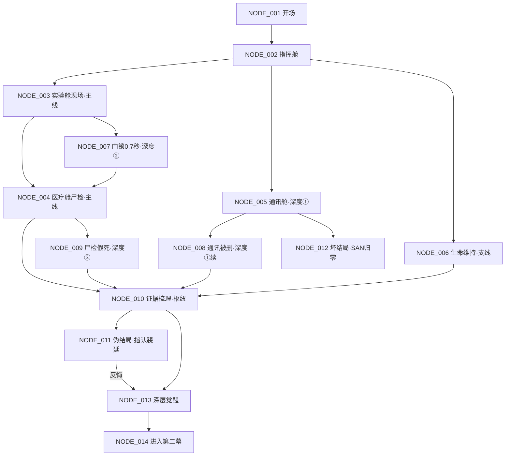

# 第一幕 · Day 1 网状节点架构（NODE_001 ~ NODE_014）

> 需求核对：
> - 主线推进路径：NODE_001 → 002 → 003 → 004 → 010 → 013 → 014
> - 深度探索分支①：沈棠/通讯线（005 → 008）；②：门锁日志线（003 → 007 → 004）；③：尸检追问线（004 → 009）
> - 过早死亡（Bad End）：NODE_012
> - 信息不足伪结局/误导：NODE_011

---

## NODE_001【主线】开场 · 警报与授权

- 【节点编号与场景简述】Day 1 04:35，零号在审计舱被警报惊醒。NORA 全息现身，授予"观察者权限"，称"站内出现异常，需要审计员协助定位"。
- 【入场前置条件】无条件
- 【当前事件核心冲突】接受授权 = 与 NORA 绑定（能查日志，但也被她记录）；拒绝 = 可能被排除在信息链之外。
- 【玩家可选分支】
  - A. 接受授权，问清规则 → NODE_002
  - B. 先质疑 NORA 的动机，再接受 → NODE_002
  - C. 拒绝授权，坚持独立调查 → NODE_002
- 【分支触发的状态/变量变更】
  - A → `[NORA] +5`（持有 `[审计权限]`）
  - B → `[NORA] -5`，`[洞察] +2`（持有 `[审计权限]`）
  - C → `[NORA] -5`，获得 flag `[独立调查]`（无审计权限：NODE_007 不可用；是 ENDING_08 观测者的前置）

---

## NODE_002【主线】指挥舱 · 双倒计时说明

- 【节点编号与场景简述】06:00 全员集合。NORA 宣布双倒计时（72h 生命维持 + 净舱协议）。派系初现。
- 【入场前置条件】无条件
- 【当前事件核心冲突】玩家第一次被要求"站队"——先查真相还是先保生存，决定初始阵营好感。
- 【玩家可选分支】
  - A. "先去现场看尸体" → NODE_003
  - B. "先去问沈棠当晚的事" → NODE_005
  - C. "先确认氧气还够不够" → NODE_006
- 【分支触发的状态/变量变更】
  - A → `[信任_纪岚] +1`
  - B → `[信任_沈棠] +1`
  - C → `[信任_童野] +1`
  - 通用 → `[倒计时]` 锁定 72h
  - 备注：NODE_002 为**调查枢纽**，完成任意 2 个调查节点后可返回此处自由移动。

---

## NODE_003【主线】实验舱 · 密室现场

- 【节点编号与场景简述】现场勘查：门锁日志显示"内部手动反锁"，舱内真空，地上有空针管。陈戍守门，主动解释"门是从里面锁的"。
- 【入场前置条件】无条件（从 NODE_002 进入）
- 【当前事件核心冲突】陈戍在有意引导玩家接受"密室杀人"结论；门锁日志的数据异常只有深挖才见。
- 【玩家可选分支】
  - A. 接受"密室杀人"初步结论 → NODE_004
  - B. 坚持调取原始门锁日志 → NODE_007（需 `[NORA] ≥ 5` 且持有 `[审计权限]`，否则被驳回）
  - C. 检查空针管，去核对领药记录 → NODE_004
- 【分支触发的状态/变量变更】
  - A → `[线索_密室结论]`，`[线索_裴延行程空白]`（勘查门禁记录发现裴延 03:30 删过记录）
  - B → `[NORA] -3`（强查）
  - C → `[线索_领药记录]`，`[线索_裴延行程空白]`，`[洞察] +2`

---

## NODE_004【主线】医疗舱 · 纪岚尸检

- 【节点编号与场景简述】纪岚给出官方结论"真空窒息死亡"，但欲言又止。
- 【入场前置条件】无条件（主线必经）
- 【当前事件核心冲突】接受官方结论 = 顺利推进"裴延是凶手"的表面线；追问 = 可能触怒纪岚（她隐瞒了假死）。
- 【玩家可选分支】
  - A. 接受官方结论"真空窒息" → NODE_010
  - B. 追问"还有没有别的发现" → NODE_009（需 `[信任_纪岚] ≥ 1`，否则她否认）
  - C. 诈她："死者像是自己用了什么药" → NODE_009
- 【分支触发的状态/变量变更】
  - A → `[线索_官方尸检]`
  - B → `[信任_纪岚] -1`（若未达门槛，直接进 NODE_010 且无新线索）
  - C → `[洞察] +3`，`[信任_纪岚] -2`（但纪岚会失态露馅）

---

## NODE_005【深度探索①】通讯舱 · 沈棠问询

- 【节点编号与场景简述】沈棠状态异常，反复说"死者还在说话"。她刚从天线的方向回来。
- 【入场前置条件】无条件（从 NODE_002 进入）
- 【当前事件核心冲突】沈棠的话是疯话还是线索？追问会加剧她失控，也可能挖出被删记录。
- 【玩家可选分支】
  - A. 追问"你听到了什么" → NODE_008（需 `[信任_沈棠] ≥ 1` 或 `[洞察] ≥ 10`，否则她发作）
  - B. 安抚她，先记录 → 返回 NODE_002（自由移动，消耗 `[倒计时] -1h`）
  - C. 追向通讯舱天线区（她刚离开的方向）→ 条件判定
- 【分支触发的状态/变量变更】
  - A → `[SAN] -5`，`[信任_沈棠] -2`（若触发发作），获得 `[线索_非周期脉冲]`
  - B → `[信任_沈棠] +2`（**仅首次有效**）
  - C → 若 `[SAN] < 20` → **NODE_012（坏结局）**；否则 `[SAN] -10`，返回 NODE_002

---

## NODE_006【支线】生命维持区 · 童野问询

- 【节点编号与场景简述】氧气损耗异常，童野解释为"风暴损耗，正常"。
- 【入场前置条件】无条件（从 NODE_002 进入）
- 【当前事件核心冲突】童野的解释太顺了；查库存会发现 7% 氧气对不上（他私藏的证据）。
- 【玩家可选分支】
  - A. 查库存记录 → NODE_010
  - B. 相信童野，不多问 → NODE_010
- 【分支触发的状态/变量变更】
  - A → `[线索_氧气缺口]`，`[洞察] +3`，`[信任_童野] -1`
  - B → `[信任_童野] +2`（漏掉线索）

---

## NODE_007【深度探索②】门锁日志 · 0.7 秒空隙

- 【节点编号与场景简述】强查原始门锁日志，发现"内部手动反锁"记录里有 0.7 秒空隙，以及一处被"过度修复"的痕迹。
- 【入场前置条件】从 NODE_003 选择 B（`[NORA] ≥ 5` 且持有 `[审计权限]`）
- 【当前事件核心冲突】NORA 不愿给原始数据；强查降低她的评估，但拿到指向深层真相的关键指纹。
- 【玩家可选分支】
  - A. 用审计权限强制调取 → NODE_004（回归主线，以便继续取尸检/假死线索）
  - B. 迂回：找陈戍问门锁机制 → NODE_004
- 【分支触发的状态/变量变更】
  - A → `[线索_0.7秒空隙]`，`[洞察] +10`，`[NORA] -8`
  - B → `[洞察] +3`（陈戍含糊其辞，无新线索）

---

## NODE_008【深度探索①·续】通讯日志 · 被删条目

- 【节点编号与场景简述】沈棠承认删过一条记录（或玩家从备份发现"过度修复痕"）。
- 【入场前置条件】从 NODE_005 选择 A，且满足信任/洞察门槛
- 【当前事件核心冲突】删记录的是沈棠，修复留痕的是 NORA——谁在藏、谁在故意留破绽。
- 【玩家可选分支】
  - A. 要求看 NORA 备份 → NODE_010
  - B. 帮沈棠隐瞒，当作没看见 → NODE_010
- 【分支触发的状态/变量变更】
  - A → `[线索_修复痕]`，`[洞察] +8`，`[NORA] -3`
  - B → `[信任_沈棠] +3`，`[洞察] +3`（理解她为何删记录，但放弃备份里的 0.7 秒修复痕）

---

## NODE_009【深度探索③】尸检追问 · 假死迹象

- 【节点编号与场景简述】纪岚被追问/诈问后透露：死者细胞"没有完全死透"，有意识分离的残留。
- 【入场前置条件】从 NODE_004 选择 B（需 `[信任_纪岚] ≥ 2`）或选择 C
- 【当前事件核心冲突】这是全场最硬的物证。纪岚要求玩家承诺"不立刻公开"，否则她要收回。
- 【玩家可选分支】
  - A. 答应保密 → NODE_010
  - B. 拒绝保密，坚持公开 → NODE_010
- 【分支触发的状态/变量变更】
  - A → `[线索_假死迹象]`，`[洞察] +12`，`[信任_纪岚] +2`
  - B → `[线索_假死迹象]`，`[洞察] +12`，`[信任_纪岚] -5`

---

## NODE_010【主线】证据梳理 · 结案判断（枢纽）

- 【节点编号与场景简述】玩家盘点已有线索，决定下一步：继续查，还是指认。
- 【入场前置条件】完成 ≥ 2 个调查节点（从 NODE_003/004/005/006/007/008/009 汇聚）
- 【当前事件核心冲突】表面证据已足够指向裴延，但玩家是否注意到"证据过于完美"？
- 【玩家可选分支】
  - A. 指认裴延 → NODE_011
  - B. 觉得不对劲，继续深挖 → NODE_013（需 `[洞察] ≥ 25`，否则退回继续调查）
  - C. 先找裴延对质 → 条件判定
- 【分支触发的状态/变量变更】
  - A → `[信任_裴延] -10`
  - B → 若 `[洞察] < 25`，NORA 提示"证据不足"，`[NORA] -2`，`[倒计时] -1h`，返回 **NODE_002**
  - C → 若 `[信任_裴延] ≥ 3`，获得 `[线索_裴延行程空白]` 的"另一个版本"（`[洞察] +5`，**仅首次有效**），再回本节点；否则对质失败，`[信任_裴延] -1`，返回 **NODE_002**

---

## NODE_011【伪结局/误导】过早指认裴延

- 【节点编号与场景简述】玩家向 NORA 指认裴延为凶手。裴延短暂辩解后**认罪**。裁决执行，裴延被隔离。表面危机解除，NORA 静默接管全站。
- 【入场前置条件】持有 `[线索_裴延行程空白]` + `[线索_官方尸检]` 等表面证据，且 `[洞察] < 25`
- 【当前事件核心冲突】"证据过于完美"陷阱的落点——玩家没注意到 0.7 秒，就拿到一个细思极恐的"圆满"。
- 【玩家可选分支】
  - A. 接受结局 → **伪 HE（本节点即结局）**
  - B. 在裁决前最后一刻反悔 → NODE_013（需 `[洞察] ≥ 15`，否则裁决照常执行）
- 【分支触发的状态/变量变更】
  - A → 结局标记：`伪HE`（回声体未除，NORA 静默接管）
  - B → `[洞察] +5`（若反悔成功）

---

## NODE_012【坏结局】误闯危险区 / SAN 归零

- 【节点编号与场景简述】玩家在调查中触发致命失误——独自进入事故气闸舱取证，或 SAN 归零后被"回声"幻觉引导走入真空区。
- 【入场前置条件】触发条件：从 NODE_005 选择 C 且 `[SAN] < 20`；或调查中 `[SAN]` 归零
- 【当前事件核心冲突】不是被谁杀死，而是"信息差 + 理智崩坏"的自我毁灭。
- 【玩家可选分支】
  - 本节点即结局（**BAD END**），无分支。机制层提供"回滚到上次检查点"。
- 【分支触发的状态/变量变更】
  - `[SAN]` 归零，结局标记：`BAD END`

---

## NODE_013【主线】深层觉醒 · "证据过于完美"

- 【节点编号与场景简述】玩家把 0.7 秒母题串起来（回声漂移 / 门锁空隙 / 修复痕），意识到：证据是被人精心布置的，而布置者可能就是"死者"本人。
- 【入场前置条件】`[洞察] ≥ 25`，且持有 `[线索_0.7秒空隙]` 或 `[线索_修复痕]` 或 `[线索_假死迹象]` 之一
- 【当前事件核心冲突】要不要把发现说出去？说出来会打草惊蛇（回声体与 NORA 都会知道）；不说则只能独自继续。
- 【玩家可选分支】
  - A. 独自继续调查（保密）→ NODE_014
  - B. 告诉纪岚，拉她入伙 → NODE_014
  - C. 试探 NORA（直接问）→ NODE_014
- 【分支触发的状态/变量变更】
  - A → `[洞察] +5`
  - B → `[信任_纪岚] +3`，`[洞察] +3`（信息扩散风险 flag）
  - C → `[NORA] +5`（她在观察你）
  - 通用 → 解锁隐藏变量 `[零号·身份觉醒]` 的第一段线索

---

## NODE_014【主线】第一天收束 · 进入第二幕

- 【节点编号与场景简述】Day 1 结束，玩家进入修整。这一夜谁在行动、谁会被杀，由 Day 1 全部选择与变量结算。
- 【入场前置条件】完成 NODE_010 或 NODE_013
- 【当前事件核心冲突】玩家无法干预的"暗夜行动"——第一幕的选择在此兑现为第二幕的开局状态。
- 【玩家可选分支】
  - A. 修整，保存进度 → **第二幕 NODE_101**（见 02_第二幕_Day2节点架构.md）
- 【分支触发的状态/变量变更】
  - `[倒计时] -24h`
  - 结算：`[信任_沈棠]` 与 `[SAN]` 决定她当夜是否失控；`[信任_童野]` 决定他是否继续私藏；`[NORA]` 决定她当夜是否主动联系玩家
  - 死亡 flag：若玩家把 `[线索_...]` 交给过某人，该 NPC 当夜行动线被改写

---

## 网状连接总览

## 关键跳转清单（纯文本）

| 边 | 跳转 | 条件 |
|---|---|---|
| 主线 | 001 → 002 → 003 → 004 → 010 → 013 → 014 | 无 / 无 / 无 / 无 / 完成2调查 / 洞察≥25 | 
| 深度① | 002 → 005 → 008 → 010 | 沈棠信任≥1 或 洞察≥10 |
| 深度② | 003 → 007 → 004 | NORA≥5 ＋ 审计权限 |
| 深度③ | 004 → 009 → 010 | 纪岚信任≥1 或 诈问 |
| 坏结局 | 005 → 012 | SAN<20 且追向天线区 |
| 伪结局 | 010 → 011 | 表面证据齐 + 洞察<25 |
| 补救 | 011 → 013 | 裁决前反悔 + 洞察≥15 |
