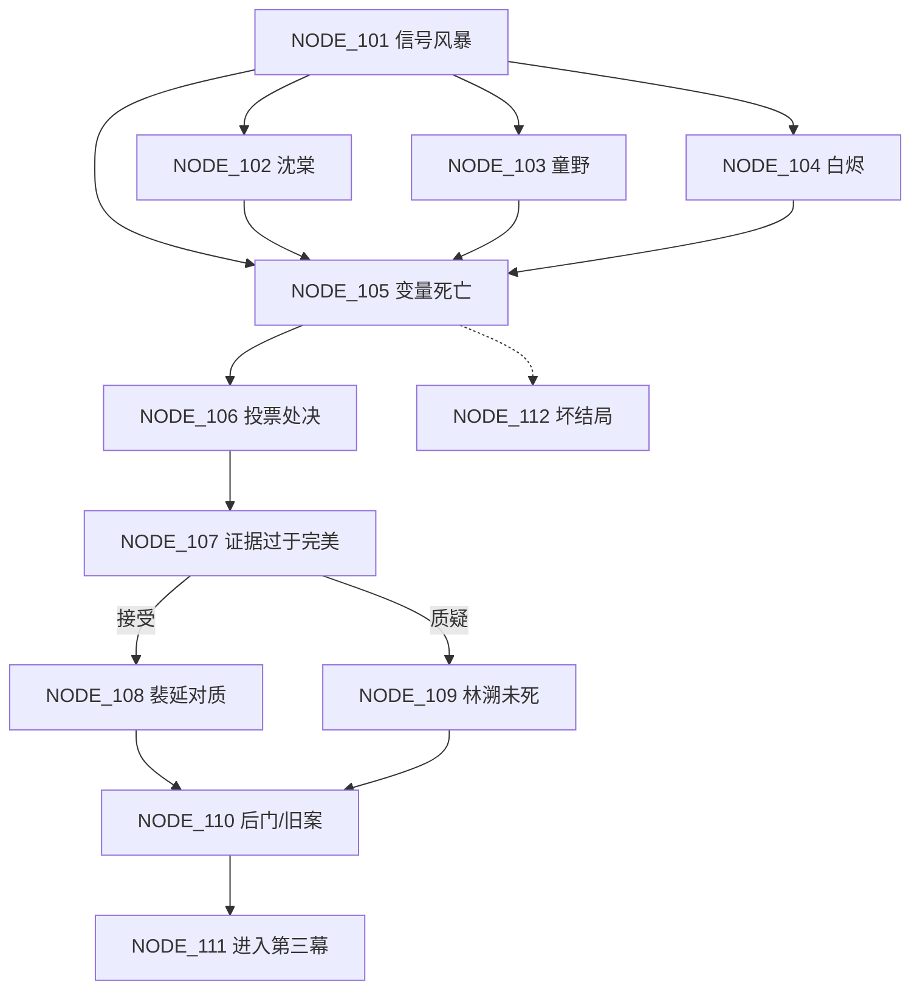

# 第二幕 · Day 2 网状节点架构（NODE_101 ~ NODE_112）

> 衔接：第一幕 NODE_014 → **NODE_101**（本幕开场）。
> 本幕职责：激化矛盾、兑现第一幕的变量结算、引入"变量死亡"与"投票处决"机制，并**补齐审查报告中缺失的信任/洞察产出**（白烬、裴延、童野、NORA）。

---

## NODE_101【主线】第二幕开场 · 第二次信号风暴

- 【节点编号与场景简述】Day 2 00:00，第二次信号风暴袭击全站。灯光闪烁，通讯舱方向传来异响。这是物理倒计时的第二次打击。
- 【入场前置条件】完成第一幕 NODE_014
- 【当前事件核心冲突】风暴中先救谁/先查哪里，决定谁活谁伤，也决定第二幕能拿到谁的信任——这是"零和"的又一次显形。
- 【玩家可选分支】
  - A. 冲向通讯舱救沈棠 → NODE_102
  - B. 冲向生命维持区找童野 → NODE_103
  - C. 冲向领航舱找白烬 → NODE_104
  - D. 留在安全区观察记录 → NODE_105
- 【分支触发的状态/变量变更】
  - A → `[信任_沈棠] +2`
  - B → `[信任_童野] +2`
  - C → `[信任_白烬] +2`
  - D → `[NORA] +3`
  - 通用 → `[倒计时] -4h`，`[SAN] -5`（风暴暴露）

---

## NODE_102【深度探索①】通讯舱 · 沈棠失控

- 【节点编号与场景简述】风暴中沈棠抱着头，一会儿哭，一会儿用"我们"的口吻说话。
- 【入场前置条件】从 NODE_101 选 A
- 【当前事件核心冲突】沈棠濒临覆盖，救她还是听她说——她嘴里的话可能是唯一真相，也可能是污染源。
- 【玩家可选分支】
  - A. 安抚并追问"我们是谁" → NODE_105
  - B. 强行注射镇静剂 → NODE_105
  - C. 只记录她的疯话，不介入 → NODE_105
- 【分支触发的状态/变量变更】
  - A → `[信任_沈棠] +3`，`[SAN] -5`，获得 `[线索_风暴低语]`
  - B → `[信任_沈棠] -3`，`[SAN] +5`
  - C → `[洞察] +3`

---

## NODE_103【支线→种子】生命维持区 · 童野暴露

- 【节点编号与场景简述】风暴导致氧气骤降，童野藏在种子库区的备用氧气罐暴露。
- 【入场前置条件】从 NODE_101 选 B
- 【当前事件核心冲突】童野私藏氧气的事被撞破——揭发能平息公愤，但断了他的信任；帮他隐瞒则埋下"种子线"的伏笔。
- 【玩家可选分支】
  - A. 当众揭发 → NODE_105
  - B. 帮他隐瞒 → NODE_105
  - C. 私下问清用途 → NODE_105
- 【分支触发的状态/变量变更】
  - A → `[信任_童野] -5`，`[信任_全员] +1`（公愤平息）
  - B → `[信任_童野] +4`（种子线前置）
  - C → `[信任_童野] +3`，`[洞察] +3`（得知种子库真相）

---

## NODE_104【支线→背叛】领航舱 · 白烬试探

- 【节点编号与场景简述】白烬在检查逃生舱，见玩家来了，似笑非笑："你想不想知道逃生舱到底能坐几个人？"
- 【入场前置条件】从 NODE_101 选 C
- 【当前事件核心冲突】白烬抛出的橄榄枝——结盟意味着背叛全站，拒绝则可能错过唯一生路。
- 【玩家可选分支】
  - A. 与他结盟（先答应） → NODE_105
  - B. 当面拒绝并警告 → NODE_105
  - C. 不动声色套话 → NODE_105
- 【分支触发的状态/变量变更】
  - A → `[信任_白烬] +4`，获得 `[线索_逃生舱疑点]`
  - B → `[信任_白烬] -3`
  - C → `[信任_白烬] +2`，`[洞察] +2`

---

## NODE_105【主线】风暴后 · 变量死亡

- 【节点编号与场景简述】风暴平息。一名关键 NPC 被发现死亡/重伤。众人开始互相指责。
- 【入场前置条件】从 NODE_101(D) 或 NODE_102/103/104 汇聚
- 【当前事件核心冲突】**死亡名单是变量**——死的是谁，由第一幕 NODE_014 的结算决定。玩家第一次直面"我的选择害死了谁"。
- 【玩家可选分支】
  - A. 调查死因 → NODE_106
  - B. 先安抚众人、维持秩序 → NODE_106
  - C. 怀疑是某人所为并当众质问 → NODE_106
- 【分支触发的状态/变量变更】
  - A → `[洞察] +3`
  - B → `[信任_全员] +1`，`[SAN] +5`
  - C → `[信任_目标] -2`
  - 通用 → 结算死亡 flag（引用 NODE_014：`[信任_沈棠]`/`[SAN]` 决定沈棠是否当夜失控；交出的线索决定相关 NPC 当夜行动线）

---

## NODE_106【主线·博弈】派系撕裂 · 投票处决

- 【节点编号与场景简述】"回地球派"提议投票处决最大嫌疑人（裴延）以通过 NORA 裁决；"查真相派"反对。全员站队。
- 【入场前置条件】无条件
- 【当前事件核心冲突】囚徒困境第一次显形：投票处决裴延能"解决"裁决，但可能冤杀；弃权则要面对更糟的倒计时。
- 【玩家可选分支】
  - A. 支持处决投票 → NODE_107
  - B. 反对并拖延 → NODE_107
  - C. 弃权观察 → NODE_107
- 【分支触发的状态/变量变更】
  - A → `[信任_裴延] -5`，`[NORA] +10`（接近净舱/误导线）
  - B → `[信任_裴延] +3`，`[信任_纪岚] +2`
  - C → `[洞察] +2`（观测者线前置）

---

## NODE_107【主线·深层门槛】证据过于完美

- 【节点编号与场景简述】玩家复盘证据链，发现指向裴延的证据"太完整了"——完整到像有人故意摆好。
- 【入场前置条件】无条件
- 【当前事件核心冲突】这是从表面真相滑向隐藏真相的第一道门：接受"完美"= 安心指认；质疑"完美"= 打开深层线。
- 【玩家可选分支】
  - A. 接受证据链 → NODE_108
  - B. 追问"为什么这么完美" → NODE_109
  - C. 先不表态 → NODE_108
- 【分支触发的状态/变量变更】
  - A → 获得 `[线索_证据链完整]`
  - B → `[洞察] +8`（深层线推进）
  - C → `[洞察] +2`

---

## NODE_108【支线】裴延对质

- 【节点编号与场景简述】玩家与裴延单独对质。裴延冷静，但提到"女儿"时第一次露出破绽。
- 【入场前置条件】无条件
- 【当前事件核心冲突】逼供还是共情——共情能挖出他"没杀人"的真相，逼供只会让他更认命。
- 【玩家可选分支】
  - A. 提他的女儿，给他解释的机会 → NODE_110
  - B. 用证据逼他认罪 → NODE_110
  - C. 冷眼观察，什么也不说 → NODE_110
- 【分支触发的状态/变量变更】
  - A → `[信任_裴延] +4`，`[洞察] +5`
  - B → `[信任_裴延] -4`（若他认罪，误导线加深）
  - C → `[洞察] +3`

---

## NODE_109【深度探索②】深层 · 林溯未死的影子

- 【节点编号与场景简述】玩家把 0.7 秒、修复痕、假死迹象串起来，逼近"死者未死"的可能。
- 【入场前置条件】`[洞察] ≥ 30` 且持有任一深层线索（0.7秒空隙 / 修复痕 / 假死迹象）
- 【当前事件核心冲突】这个猜想太疯狂，但越查越真。要不要告诉别人？告诉谁？
- 【玩家可选分支】
  - A. 独自深挖 → NODE_110
  - B. 告诉纪岚 → NODE_110
  - C. 试探 NORA → NODE_110
- 【分支触发的状态/变量变更】
  - A → `[洞察] +5`
  - B → `[信任_纪岚] +3`，`[洞察] +3`
  - C → `[NORA] +5`，`[洞察] +2`

---

## NODE_110【深度探索③】陈戍后门 / 纪岚旧案

- 【节点编号与场景简述】陈戍主动找玩家，手里攥着后门权限码；纪岚则提起导师旧案，把矛头指向林溯。
- 【入场前置条件】无条件
- 【当前事件核心冲突】两条关键资源同时出现——后门（物理生路）vs 旧案（真相钥匙），玩家只能先押一边。
- 【玩家可选分支】
  - A. 接过陈戍的后门 → NODE_111
  - B. 听纪岚讲完导师旧案 → NODE_111
  - C. 两不相帮，记下就走 → NODE_111
- 【分支触发的状态/变量变更】
  - A → 获得 `[线索_后门权限码]`，`[信任_陈戍] +3`
  - B → `[信任_纪岚] +4`，`[洞察] +5`
  - C → `[洞察] +2`

---

## NODE_111【主线】第二幕收束 · 夜幕降临

- 【节点编号与场景简述】Day 2 结束。玩家盘点：有的人已经死了，有的线索已经浮出水面，离倒计时只剩一天。
- 【入场前置条件】完成 NODE_106 之后（或经 NODE_107~110 汇聚）
- 【当前事件核心冲突】这一夜谁还会死、谁在密谋，取决于第二幕全部选择。
- 【玩家可选分支】
  - A. 修整，进入第三幕 → **NODE_201**
- 【分支触发的状态/变量变更】
  - `[倒计时] -24h`
  - 第二幕结算：信任 / 洞察 / SAN / 存活 flag 带入第三幕

---

## NODE_112【坏结局】第二幕 · 被反噬

- 【节点编号与场景简述】玩家在风暴中强行独自行动，或在投票处决中站错队，被当成"异常体"处决/被风暴吞没。
- 【入场前置条件】触发条件：风暴中独自行动且 `[SAN] < 20`；或投票中因信任过低被多数票反噬
- 【当前事件核心冲突】不是真相的失败，而是**博弈中的失足**——站错队、信错人、赌错时机。
- 【玩家可选分支】
  - 本节点即结局（**BAD END**），无分支。机制层提供"回滚到上次检查点"。
- 【分支触发的状态/变量变更】
  - 结局标记：`BAD END`（第二幕中途夭折）

---

## 第二幕连接总览

## 可达性自检（对照审查报告）

| 审查缺口 | 本幕补全 |
|---|---|
| 白烬信任无来源（ENDING_03） | NODE_101 C(+2) + NODE_104 A(+4) = **+6** ✅ |
| 裴延信任无来源（NODE_010 C） | NODE_106 B(+3) + NODE_108 A(+4) = **+7** ✅ |
| 童野信任上界不足（ENDING_06） | NODE_101 B(+2) + NODE_103 B(+4) = **+6**（叠加第一幕+3 = 9 ≥ 8）✅ |
| 洞察上界不足（ENDING_01/05） | NODE_107 B(+8)、108 A(+5)、109 A(+5)、110 B(+5) 等，叠加第一幕可过 60 ✅ |
| NORA 上界不足（ENDING_04） | NODE_101 D(+3)、106 A(+10)、109 C(+5)，叠加第三幕交权线可达 80 ✅ |
