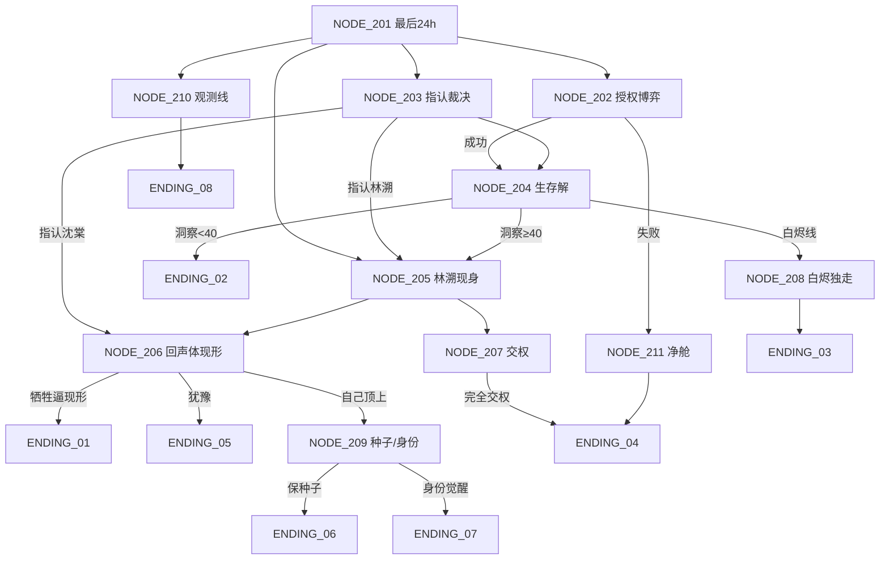

# 第三幕 · Day 3 网状节点架构（NODE_201 ~ NODE_211）

> 衔接：第二幕 NODE_111 → **NODE_201**（本幕开场）。
> 本幕职责：倒计时见底、全员摊牌博弈、隐藏真相揭晓、路由到 8 个结局。
> 结局节点引用 `../结局/` 目录下的 `ENDING_XX`，本图只负责"如何抵达"。

---

## NODE_201【主线】终局开场 · 最后 24 小时

- 【节点编号与场景简述】Day 3 凌晨。倒计时见底，NORA 下最后通牒：24 小时内重启推进器（需多数授权），否则执行净舱。
- 【入场前置条件】完成第二幕 NODE_111
- 【当前事件核心冲突】生存解（合作）与裁决（背叛）进入最终倒计时。玩家必须决定自己主导哪条路——而每条路的终点都通向不同的结局。
- 【玩家可选分支】
  - A. 主导重启推进器（合作） → NODE_202
  - B. 主导指认异常体（裁决） → NODE_203
  - C. 继续深挖真相（深层） → NODE_205（需 `[洞察] ≥ 40`，否则被驳回回本节点）
  - D. 什么都不做，只记录（观测） → NODE_210
- 【分支触发的状态/变量变更】
  - B → `[NORA] +10`
  - D → `[洞察] +3`（观测者线）

---

## NODE_202【主线·博弈】重启推进器 · 多数授权

- 【节点编号与场景简述】玩家挨个游说，争取多数授权重启推进器。每个人都有自己的价码。
- 【入场前置条件】从 NODE_201 选 A
- 【当前事件核心冲突】囚徒困境摊牌——授权是公共品，但有人（白烬、回声体）不想合作。
- 【玩家可选分支】
  - A. 用诚意争取授权 → 条件判定
  - B. 用资源/交易换取授权 → NODE_204
  - C. 放弃合作，转而指认 → NODE_203
- 【分支触发的状态/变量变更】
  - A → 判定：若 `[信任_全员均值] ≥ 0` 且 `[存活NPC] ≥ 4` → NODE_204；否则 → NODE_211
  - B → `[倒计时] -2h`，`[信任_全员] -1`（收买有代价）
  - C → `[NORA] +10`

---

## NODE_203【主线·表面线】指认 · 裁决路线

- 【节点编号与场景简述】玩家向 NORA 提交指认。指认谁，就是谁死。
- 【入场前置条件】从 NODE_201 选 B 或 NODE_202 选 C
- 【当前事件核心冲突】指认裴延 = 表面真相（幸存/伪HE）；指认错 = 悲剧；指认对（回声体）= 真相。
- 【玩家可选分支】
  - A. 指认裴延 → NODE_204
  - B. 指认沈棠（怀疑她是回声体） → NODE_206
  - C. 指认"死者"林溯 → NODE_205
- 【分支触发的状态/变量变更】
  - 通用 → `[NORA] +15`
  - A → `[信任_裴延] -10`
  - B → 判定：若沈棠确为回声体 → NODE_206（真相线）；否则 → ENDING_05 变体（误杀 + 真回声体得手）

---

## NODE_204【主线】生存解达成 · 幸存

- 【节点编号与场景简述】推进器重启成功（或裁决结案），幸存者准备返航。
- 【入场前置条件】满足生存解条件（NODE_202 A 通过 或 NODE_203 A 裁决通过）
- 【当前事件核心冲突】活下来了，但真相呢？回声体还在不在返航舱里？
- 【玩家可选分支】
  - A. 接受现状，返航 → **ENDING_02**（需 `[洞察] < 40`）
  - B. 返航前还想弄清真相 → NODE_205（需 `[洞察] ≥ 40`）
  - C. 与白烬独走 → NODE_208（需 `[信任_白烬] ≥ 6` 且持有密钥）
- 【分支触发的状态/变量变更】
  - A → 结算 ENDING_02（沉默的幸存者）

---

## NODE_205【深层】真相揭晓 · 林溯现身

- 【节点编号与场景简述】深层线核心。玩家找到林溯（或林溯主动现身），揭穿假死与合谋，以及回声体的存在。
- 【入场前置条件】`[洞察] ≥ 40` 且持有深层线索（0.7秒空隙 / 修复痕 / 假死迹象 之一）
- 【当前事件核心冲突】林溯的话可信吗？他可能是救世主，也可能是另一种控制。NORA 也在场——三方对弈开始。
- 【玩家可选分支】
  - A. 相信林溯，联手逼回声体现形 → NODE_206
  - B. 怀疑林溯，与 NORA 联手 → NODE_207
  - C. 都不信，要求当众摊牌 → NODE_206
- 【分支触发的状态/变量变更】
  - C → `[洞察] +5`

---

## NODE_206【深层】回声体现形 · 最终摊牌

- 【节点编号与场景简述】用"不可两全的死亡抉择"逼回声体暴露决策模式。全站屏息等它露馅。
- 【入场前置条件】从 NODE_205 选 A/C 或 NODE_203 选 B（沈棠确为回声体）
- 【当前事件核心冲突】摊牌成功 = 真相大白，但代价可能是某个人的命。玩家要做最后的选择：保多数还是保个体。
- 【玩家可选分支】
  - A. 牺牲一个关键 NPC 逼现形 → 条件判定 → **ENDING_01**
  - B. 不愿任何人死，犹豫 → 回声体趁机得手 → **ENDING_05**
  - C. 自己顶上"被牺牲"的位置 → NODE_209
- 【分支触发的状态/变量变更】
  - A → 判定 ENDING_01：`[洞察] ≥ 60` ＋ 三线索齐 ＋ `[信任_纪岚] ≥ 5` ＋ 陈戍存活 ＋ 身份觉醒=真人 → 触发；否则降级 → ENDING_05

---

## NODE_207【深层/背叛】与 NORA 联手 · 交权

- 【节点编号与场景简述】玩家选择把最终决定权交给 NORA。
- 【入场前置条件】从 NODE_205 选 B
- 【当前事件核心冲突】交权是捷径，但 NORA 会怎么用？她可能是裁决者，也可能是收割者。
- 【玩家可选分支】
  - A. 完全交权 → 条件判定
  - B. 有限授权 → NODE_206
  - C. 反悔 → NODE_205
- 【分支触发的状态/变量变更】
  - A → `[NORA] +40`；判定：若 `[NORA] ≥ 80` → **ENDING_04**（净舱）；否则回 NODE_202
  - B → `[NORA] +10`

---

## NODE_208【背叛线】白烬独走

- 【节点编号与场景简述】玩家与白烬在混乱中抢先登上逃生舱，脱离卡戎站。
- 【入场前置条件】`[信任_白烬] ≥ 6` 且持有 `[逃生舱密钥]` 且白烬存活
- 【当前事件核心冲突】舱内生命维持读数闪了一下——"够一个人到家"。
- 【玩家可选分支】
  - A. 接受现状 → **ENDING_03**
  - B. 反悔，想回去 → 白烬动手 → **ENDING_03** 变体（被抛下/同归于尽）
- 【分支触发的状态/变量变更】
  - 结局标记：`ENDING_03`（与虎谋皮）

---

## NODE_209【秘密线】种子 / 身份觉醒

- 【节点编号与场景简述】两个秘密线的交汇：童野的种子库，或玩家自己的身份。
- 【入场前置条件】从 NODE_206 选 C（自己顶上）或持 `[线索_氧气缺口]` 未揭发
- 【当前事件核心冲突】保人还是保火种；以及"我是不是回声体"的最终答案。
- 【玩家可选分支】
  - A. 与童野保种子 → 条件判定
  - B. 面对自己的身份 → 条件判定
- 【分支触发的状态/变量变更】
  - A → 判定：`[信任_童野] ≥ 8` 且童野存活 → **ENDING_06**（种子）；否则回 NODE_206
  - B → 判定：`[零号·身份觉醒] = 回声体` → **ENDING_07**（零）；否则回 NODE_206

---

## NODE_210【隐藏线】观测 · 不干预

- 【节点编号与场景简述】玩家全程不指认、不授权、不交易，只记录。倒计时见底。
- 【入场前置条件】全程关键抉择均为"不选/观察" 且 `[洞察] ≥ 50`
- 【当前事件核心冲突】净舱协议因"无被观测到的污染行为"而无法触发；众人被迫一起等死，反而放下猜忌。
- 【玩家可选分支】
  - A. 接受这个意外结局 → **ENDING_08**
  - B. 最后时刻还是出手 → NODE_202
- 【分支触发的状态/变量变更】
  - A → 结局标记：`ENDING_08`（观测者）

---

## NODE_211【坏结局】授权失败 · 净舱

- 【节点编号与场景简述】联合授权失败，NORA 执行净舱。
- 【入场前置条件】`[NORA] ≥ 80` 且授权失败（NODE_202 A 判定失败）
- 【当前事件核心冲突】白光。
- 【玩家可选分支】
  - 本节点即结局（**ENDING_04**），无分支。
- 【分支触发的状态/变量变更】
  - 结局标记：`ENDING_04`（净舱 · 团灭）

---

## 第三幕连接总览

## 结局路由速查

| 结局 | 第三幕入口 |
|---|---|
| ENDING_01 真名 | 205 → 206 A（条件判定通过） |
| ENDING_02 沉默的幸存者 | 202 A 成功 → 204 A |
| ENDING_03 与虎谋皮 | 204 C → 208 |
| ENDING_04 净舱 | 207 A（NORA≥80）或 211 |
| ENDING_05 回声 | 206 B（犹豫）或 203 B（误杀） |
| ENDING_06 种子 | 209 A |
| ENDING_07 零 | 209 B |
| ENDING_08 观测者 | 210 A |
